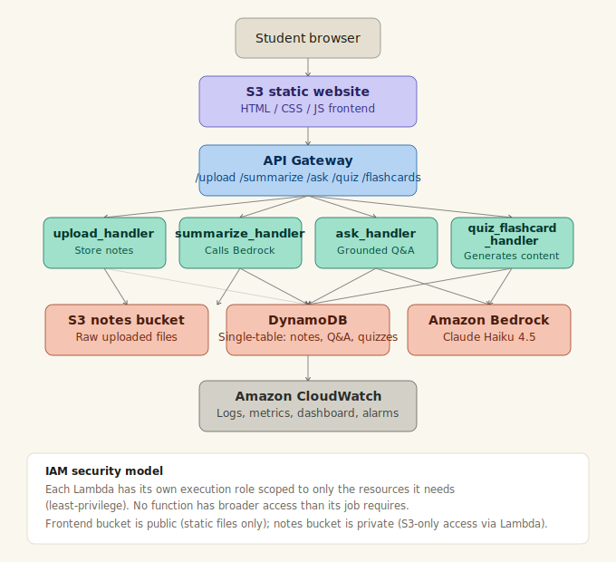

# AI Study Assistant

A serverless, AI-powered study companion built entirely on AWS. Upload your notes and get instant summaries, grounded answers to your questions, auto-generated quizzes, and flashcards — all powered by Claude via Amazon Bedrock.

Built as a course project demonstrating AWS cloud infrastructure, serverless architecture, and generative AI integration.

## What it does

- **Upload** study notes (`.txt` files)
- **Summarize** — get 5-7 bullet-point summaries of any note
- **Ask** — ask questions about your notes and get answers grounded in that specific document (not general AI knowledge)
- **Quiz** — auto-generate 5 multiple-choice questions to test understanding
- **Flashcards** — auto-generate 8 front/back flashcards for key terms and concepts

## Architecture



**Flow:** Student's browser → S3-hosted static frontend → API Gateway → one of four Lambda functions → S3 (file storage) + DynamoDB (metadata/history) + Amazon Bedrock (Claude Haiku 4.5 for AI features). CloudWatch monitors everything.

## Why these AWS services

| Service | Role | Why |
|---|---|---|
| **S3** (×2 buckets) | Frontend hosting + private note storage | No servers to manage; pay only for storage used; clean separation between public static files and private user data |
| **Lambda** | Compute for all 4 backend functions | Serverless — no idle server cost, scales automatically, each function does one job |
| **API Gateway** | HTTP routing to Lambda | Standard front door for serverless APIs; handles CORS and request routing |
| **DynamoDB** | Metadata, Q&A history, quizzes, flashcards | Serverless NoSQL, single-table design keeps related student data in one query |
| **Amazon Bedrock** | Claude Haiku 4.5 for all AI features | Generative AI inside AWS's own security/IAM boundary, rather than a separate third-party API |
| **CloudWatch** | Logs, metrics, dashboard, alarm | Automatic observability for every Lambda/API call — used throughout development for debugging |
| **IAM** | Least-privilege roles per function | Each Lambda can only touch the exact resources it needs |

## Project structure

```
ai-study-assistant/
├── frontend/                  # Static HTML/CSS/JS, hosted on S3
│   ├── index.html
│   ├── style.css
│   └── app.js
├── backend/
│   ├── lambda_functions/
│   │   ├── upload_handler/
│   │   ├── summarize_handler/
│   │   ├── ask_handler/
│   │   └── quiz_flashcard_handler/
│   └── shared/
│       └── bedrock_utils.py   # Reference copy of the Bedrock-calling logic
├── infrastructure/
│   └── iam_policies/          # Least-privilege IAM policy JSON, one per function
├── docs/
│   ├── README.md
│   ├── API_DOCUMENTATION.md
│   ├── architecture-diagram.svg
│   └── DEMO_SCRIPT.md
└── tests/
    └── test_upload.py
```

## Data model

Single DynamoDB table (`StudyAssistantData`) using a `PK`/`SK` item-collection pattern:

| PK | SK | Holds |
|---|---|---|
| `USER#<student_id>` | `NOTE#<note_id>` | Upload metadata (filename, S3 key) |
| `USER#<student_id>` | `SUMMARY#<note_id>` | Generated summary |
| `USER#<student_id>` | `QA#<timestamp>` | One question + answer pair |
| `USER#<student_id>` | `QUIZ#<note_id>` | Generated quiz questions |
| `USER#<student_id>` | `CARD#<note_id>` | Generated flashcards |

A single `Query` on `PK = USER#<student_id>` returns everything belonging to that student in one call.

## Setup / deployment

1. Create two S3 buckets (frontend hosting — public; notes storage — private)
2. Create the `StudyAssistantData` DynamoDB table (on-demand billing, `PK`/`SK` as String keys)
3. Create four IAM roles using the policies in `infrastructure/iam_policies/` (replace `<yourname>` and `<your-account-id>` placeholders)
4. Deploy each Lambda function from `backend/lambda_functions/`, attaching its matching role and setting environment variables (`NOTES_BUCKET`, `TABLE_NAME`, `BEDROCK_MODEL_ID`)
5. Request Bedrock model access for Claude Haiku 4.5 in the AWS console
6. Wire up API Gateway: `/upload`, `/summarize`, `/ask`, `/quiz`, `/flashcards` — all POST, Lambda proxy integration, CORS enabled
7. Deploy the API to a stage (e.g. `dev`) and copy the Invoke URL into `frontend/app.js` (`API_BASE_URL`)
8. Upload the `frontend/` files to the frontend S3 bucket

See `API_DOCUMENTATION.md` for full request/response details on each endpoint.

## Known limitations (v1 scope)

- Only `.txt` files are supported for now — PDF text extraction (via a `pypdf` Lambda layer) is a natural next step
- Q&A is single-turn — each question is answered independently, without conversation memory
- Search is scoped to one note at a time, not across a student's full note collection

## Tech stack

Python 3.12 (Lambda) · Amazon Bedrock (Claude Haiku 4.5, cross-region inference) · API Gateway (REST) · DynamoDB (single-table design) · S3 · vanilla HTML/CSS/JS frontend